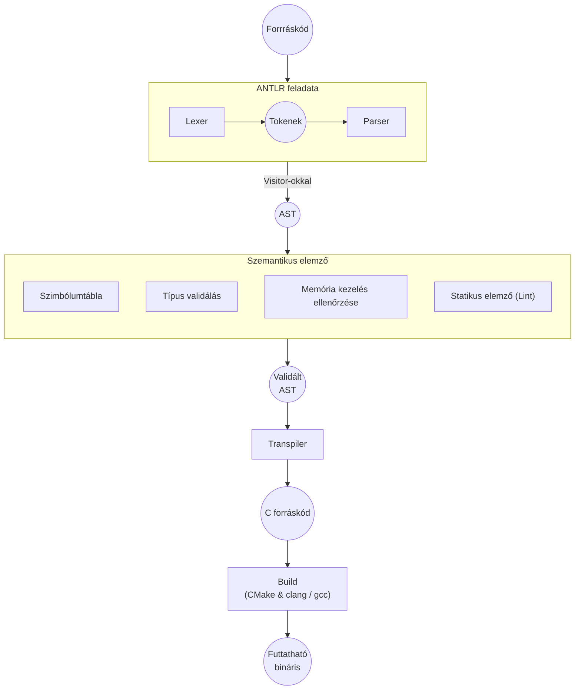

# Rhenium programozási nyelv

A Rhenium programozási nyelv objektumorientált, fordított, erősen típusos programozási nyelv, tulajdon alapú memóriakezeléssel, azaz a létrejövő objektumoknak tulajdonosai vannak, melyek élettartama határozza meg a gyermekobjektumok életét.

## Technológia

### Fordítóprogram

- ANTLR
- Kotlin
- Gradle

### Generált kód

- C (C23)
- CMake
- Clang a fő cél, konfigurálható GCC-vel fordítás is

## Fordító program felépítése



### Lexer, Parser

- Lexer: a forrásfájlt jól meghatározott tokenekre bontja
- Parser: a tokeneket beparse-olja a nyelvtan szabályai szerint, és fába rendezi a felismert node-okat

Ezek nyelvtanfájlokból, pontosabban ANTLR nyelvtanból lesznek generálva.

A forrásfájl ezen a ponton nyelvtanilag / szintaktikailag helyes, különben a Parser nem tudna belőle fát építeni.

### AST

Az AST-t ún. [Visitorokkal]() fogom felépíteni. Az ANTLR ezzel lehetőséget ad, hogy elszeparáljuk a nyelvtan leírását és az AST építését. Ez a gyakorlatban úgy jelenik meg, hogy Java/Kotlin/más kód nem fog szerepelni a nyelvtan fájlunkban.

### Szemantikus analízis

A feladata ennek a modulnak, hogy az AST-t validálja. Ehhez tartozik:

- Utasítások részeinek típusellenőrzése: kifejezések, függvényparaméterek típusainak validálása
- Szimbólumtábla építése: szimbólumok ellenőrzése, validálása
- Memória kezelés ellenőrzése, objektumok tulajdonjogának lekövetése
- Statikus analízis, linter (figyelmeztetés nem használt változók esetén, mutable változó lehetne immutable, stb...)

### Transpiler

Feladata, hogy a validált AST-ből C forráskódot készítsen.

- A generált C kódnak minden esetben helyesnek kell lennie, ha helytelen kód keletkezne, azt vagy a transpiling alatt javítani kell, ha lehet, vagy a szemantikus analízis alatt megfogni.
- Feladata egy CMake állomány létrehozásának, amely segít fordítani a kódot, és managelni a C alapú függőségeket

### Build

Feladata, hogy a generált C fájlokból CMake-kel futtatható fájlok készüljenek.

## A nyelvről és a nyelvtanról

A nyelvtanról úgy fogok írni, hogy feltételezem hogy az olvasó tud programozni "népszerű" nyelvekben, pl.: C#, Typescript, Java, C, C++. Többségében a C#, Kotlin és a Typescript nyelvekhez lesz hasonlítva a nyelvtan.

### Kifejezések

A nyelv legegyszerűbb eleme a kifejezések (expressions), amelyek aritmetikai, logikai vagy egyéb kifejezésekre csoportosíthatók. Ezek különböző operátorok használatából épülnek fel. Az operátoroknak meghatározott végrehajtási / műveleti sorrendje van (precedence).

#### Operátorok

A következő táblázat listázza ezeket, legmagasabbtól a legalacsonyabb precedence-ig. Egyenlő műveleti sorrend esetén, az operátorokat alapértelmezetten balról jobbra hajtjuk végre.

A múveleti sorrend erősen követi a C# által meghatározott sorrendet.

| Operatorok                                                                                                    | Kategória neve        |
| ------------------------------------------------------------------------------------------------------------- | --------------------- |
| symbol <br> _literals_ <br> object.property <br> array\[index] <br> objectOrNull?.property <br> function(arg) | Primaries             |
| +x, -x, !x                                                                                                    | Unary                 |
| x ^ y                                                                                                         | Pow                   |
| x \* y <br> x / y <br> x % y                                                                                  | Multiplicative        |
| x \+ y <br> x\- y                                                                                             | Additive              |
| x \< y <br> x > y <br> x \<= y <br> x >= y                                                                    | Relational            |
| x as Type <br> x is Type                                                                                      | Type-based operations |
| x == y <br> x != y                                                                                            | Equality              |
| x && y <br> x \|\| y                                                                                          | Conditional           |
| nullable ?? defaultValue                                                                                      | Null-coalescing       |
| if (condition) ifTrue else ifFalse                                                                            | Conditional           |

#### Zárójelezés

Lehetőségünk van kifejezéseket előrébb hozni a végrehajtás sorrendjében zárójelezéssel `()`.

#### Értékadó kifejezések / utasítások

Az értékadó kifejezések, más nyelvekkel ellentétben, kifejezésenként csak egyszer fordulhatnak elő. Míg ez a kód helyes pl. C#-ban, addig Rheniumban nem:

```cs
a = b =C
```

Ez a tulajdonság miatt ezeknek a kifejezéseknek nincs eredménye, igazából utasításként is felfoghatóak.

Emellett megfigyelhető, hogy az ilyen kifejezések bal oldalra úgy nevezett 'left value'-t várnak. Ezek a primary értékek sorában megtalálható kifejezések, kivétel a függvény hívás (`fn(arg)`) és az opcionális mező lekérés (`object?.field`).

Ezen kifejezések:

| Operátor | Jelentés                     |
| -------- | ---------------------------- |
| x = y    | Érték adás                   |
| x += y   | Összeadás (x = x + y)        |
| x -= y   | Kivonás (x = x - y)          |
| x \*= y  | Szorzás (x = x \* y)         |
| x /= y   | Osztás (x = x / y)           |
| x %= y   | Modulo (x = x % y)           |
| x ??= y  | Null-coalescing (x = x ?? y) |

Illetve két speciális kifejezés, amely csak egy l-value-t vár, és semmi mást.

| Operátor | Jelentés              |
| -------- | --------------------- |
| x++      | Következő (Increment) |
| x--      | Előző (Decrement)     |

### Változó létrehozása

Rhenium a Typescript szintaktikáját követi változó létrehozásban:

```ts
// Explicit típus
let variableName: Type = value;
const variableName: Type = value;

// Inferált típus
let inferredType = value;
const inferredType = value;
```

- mutable változót, `let` kulcsszóval jön létre
- immutable változót, `const` kulcsszóval jön létre

Rheniumban az immutable változók azt jelentik, hogy a változó által tárolt érték nem változhat. Ez nem tiltja meg azt, hogyha objektum van tárolva egy változó által, az ne hajtson végre az objektumon mutációt. (Tehát az immutabilitás nyelvi szinten shallow.)

Lényegében a const kulcsszóval deklarált változók nem lesznek érvényes left value-k.

Előfordulhat Alapértelmezetten a változók mutable változók (pl. függvény argument).

### if / else if / else

Rhenium a szokásos szintaktikát követi:

```cs
if (condition) {
    // ...
} else if (condition) {
    // ...
} else {
    // ...
}
```

```cs
if (condition)
    x = y; // ERROR: Missing '{'
```

### while ciklus

Szokásos szintaktika:

```cs
while (condition) {
    // ...
}
```

A nyelvben jelenleg a do-while ciklus nincs tervben.

### for ciklus

Szokásos szintaktika:

```ts
for (initialization; condition; increment) {
  loopbody;
}
```

### foreach ciklus

Ciklus, amely bejár egy kollekciót:

```cs
foreach (const variable of collection) {
    loopbody;
}
```

### Ciklusmag folytatása, és ciklusból kilépés

Szokásos `continue` és `break` kulcsszavak.

### Függvények

A függvény deklarálása a Kotlinhoz

```kt
fun Function(arg1: Type, arg2: Type): ReturnType {
    statements;
    return value;
}
```

Ha a függvény nem tér vissza értékkel, akkor azt a `: ReturnType` rész elhagyásával jelöljük, vagy expliciten a `Void` visszatérési érték használatával.

Függvényeknek nem muszáj osztályon belül deklarálva lenniük.
