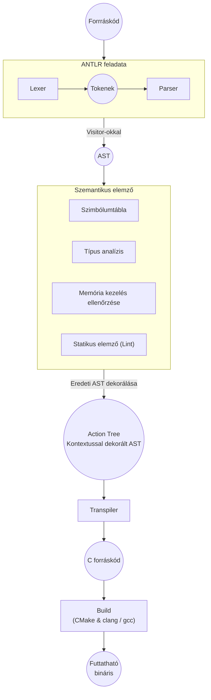

```mermaid
flowchart TD
    sourceFiles(("Forrráskód"))-->antlr
    subgraph antlr["ANTLR feladata"]
        lexer
        lexer[Lexer] --> tokens
        tokens((Tokenek)) --> parser[Parser]
    end
    ast((AST))
    antlr--"Visitor-okkal"-->ast

    ast-->semanticAnaylzer
    subgraph semanticAnaylzer["Szemantikus elemző"]
        symboltable["Szimbólumtábla"]
        typecheck["Típus analízis"]
        memcheck["Memória kezelés ellenőrzése"]
        staticheck["Statikus elemző (Lint)"]
    end

    semanticAnaylzer--"Eredeti AST dekorálása"-->actionTree(("Action Tree<br>Kontextussal dekorált AST"))-->transpiler["Transpiler"]
    transpiler-->c(("C forráskód"))
    c-->compiler["Build<br>(CMake & clang / gcc)"]
    compiler-->binary(("Futtatható<br>bináris"))
```
