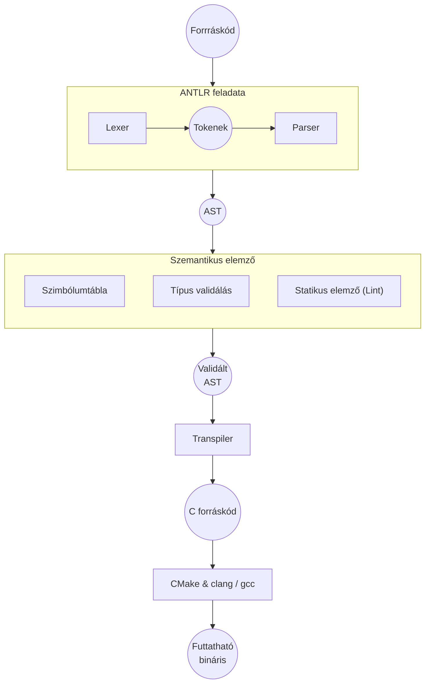

## Technológia

### Fordítóprogram
- ANTLR
- Kotlin
- Gradle

### Buildelt kódhoz
- C (C23)
- CMake
- ICU (https://github.com/unicode-org/icu)

## Felépítés

```mermaid
flowchart TD
    sourceFiles(("Forrráskód"))-->antlr
    subgraph antlr["ANTLR feladata"]
        lexer
        lexer[Lexer] --> tokens
        tokens((Tokenek)) --> parser[Parser]
    end
    ast((AST))
    antlr-->ast

    ast-->semanticAnaylzer
    subgraph semanticAnaylzer["Szemantikus elemző"]
        direction TD
        symboltable["Szimbólumtábla"]
        typecheck["Típus validálás"]
        staticheck["Statikus elemző (Lint)"]
    end

    semanticAnaylzer-->validatedAst(("Validált\nAST"))-->transpiler["Transpiler"]
    transpiler-->c(("C forráskód"))
    c-->compiler["CMake & clang / gcc"]
    compiler-->binary(("Futtatható\nbináris"))
    
```